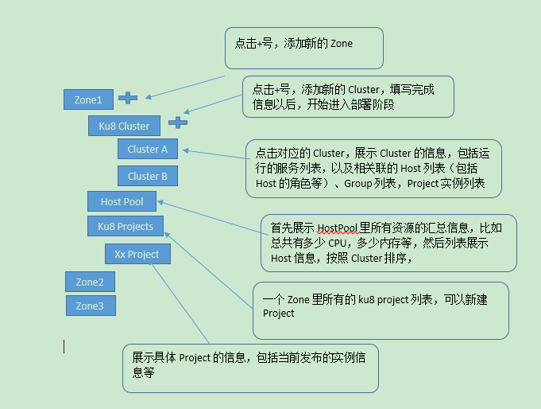

# ku8eye的资源管理设计

标签： 资源对象 领域对象 资源管理

---

   ku8eye作为kubernetes的集群管理软件，需要对集群中相关资源对象进行建模设计，以及保存到数据库中，并提供维护可视化的管理功能。目前比较重要的资源对象有如下一些：

第一：Zone（中心），一个Zone代表一个中心，通常是多个地方的机房，比如北京中心、上海中心、广州中心等，主机等资源属于某个具体中心，但也存在跨中心的一个Kubernetes集群的情况，Zone的主要属性如下：
   - Id:唯一标示
   - Name：名称
   - Location：地点（机房，区域等）  
   
第二：Host（主机），集群中的主机，可以是虚机，Host充当某个单一角色或某几个角色，Host的主要属性有以下一些：
 - Id：主机唯一标示
 - ZoneId:所属中心
 - HostName：主机名，未来建议主机名替代IP地址，作为域名，进行安装和配置管理
 - IP：主机的IP地址
 - RootPass:root密码
 - Role:主机的角色

 Host目前的角色定义如下：
 - ku8Node：kubernetes Node节点，即它的工作负载节点，安装kubelet进程的节点
 - kub8Master：kubernetes Master节点，按照kubenetes三大服务进程的节点
 - etcd:安装etcd服务的节点
 - dockerRegistry:docker注册表节点，提供镜像仓库
 
第三：ku8 Service EndPoint（ku8服务地址），用来记录kubernetes各个相关服务的访问地址，比如API Server的地址，kubelet对外的服务地址，etcd的服务地址等。按照Host的角色划分，他属于什么角色，就提供这个角色上的相关服务，对应的在ku8服务地址里记录一条或几条对应的信息即可。注意，这个表通常是不能手工修改的。它的属性主要如下：
  
 - hostId，所在主机
 - serviceName，服务名称，枚举值，如APIServer，EtcdServer,KubeletServer等
 - url,服务地址，如http://192.168.1.1:8080
 - version:服务版本号
 - status：服务状态，比如当前OK，或者ERROR，程序需要定期检测

第四：ku8 Cluster，kubernetes集群，集群里所有的Host是独享的，即完整隔离的一套kubernetes集群，彼此互不影响，一个Cluster属于一个租户。Cluster的主要属性如下：

 - Name：集群名称
 - Id：集群唯一标示
 - tanentId:租户Id，此集群所属的租户
 - Label：标签，可以逗号分隔的多个标签，用于过滤识别此集群
    kubernetes集群上可以定义多个Namespace，其目的是为了做资源的配额管理而非资源隔离，因为不同Namespace种的Pod、Service仍然可能共用同一个Node，如果要做资隔离，则可以把集群内部的Node节点划分为多个多个Group区域，部署程序的时候，发布到指定的Group节点上。因此ku8 Cluster有两个重要操作，即Namespace与Group的维护，其中Namespace是属于kubernetes集群内部的概念，因此，不需要单独的存储维护，而Cluster Group是我们新建的概念，跟Node节点标签挂钩。当一个Node节点放入到一个Group的时候，需要将这个Node打上此Group的标签。

第五，ku8 Group,即Cluster里一个组，将一组Node打上同一个Label，并记录他们的关系，主要属性如下：
 - Id:唯一标示
 - Name：组名称，比如测试环境，开发验证环境，线上环境
 - Label：组的标签特征，需要在一个Cluster中唯一，并且是英文+字母的定义
 - clusterId:所属的Cluster